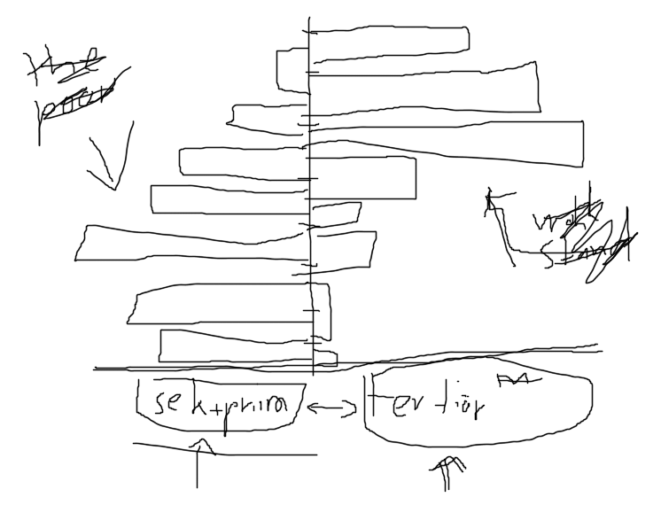
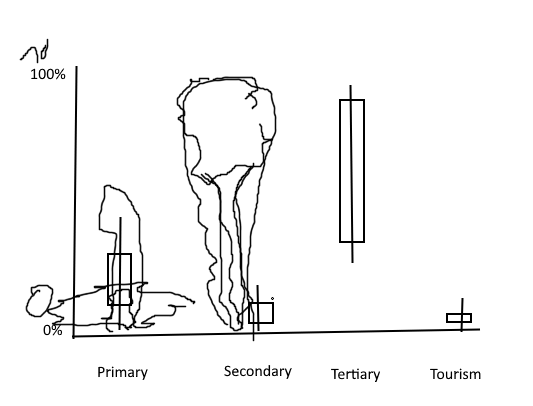

# Assignment 3: Visualizing distributions

new section: title, subtitile, some text about what you are presenting, and:
one histogram (pyramid charts also works)
one violin plot (ridgline plot also works)
one boxplot

# Ideas

## Ideas for Boxplot (Kim)

Selected variable I chose: Fatalalities per Million Inhabitants

In order to compare human suffering accorss countries fairly, we used the indicator **fatalities per million inhabitants**. This figure is calculated by diving the total number of conflict-related deaths in a country by its population, then multiplying by one million.

Unlike raw death counts, this normalized rate elminates the bias toward large-population countries and allows meaningful cross-national comparisons.

This boxplot will display the distrubution of conflict fatalities for countries grouped by their dominant economic sector: primary (agriculture), secondary (industry), tertiary (services) of tourism. It helps to reveal whether countries with differen economic compositions face different levels of human suffering in conflict.

### PLOTS

##### Histogram
- 

##### Boxplot
- Distribution of Sector Percentages for all countries.

##### Violin PLOT
- Fatalities for some Partition of countries that is BIG 

- fatalites of events distribution on country basis.

