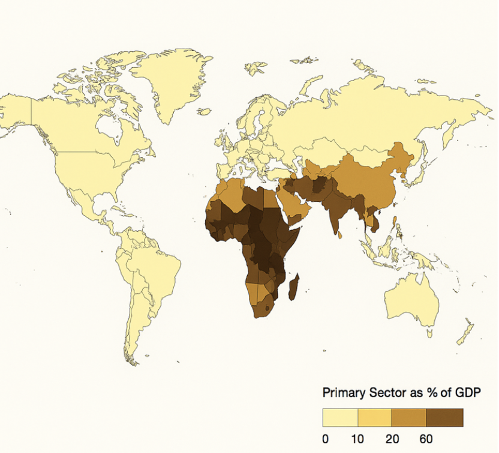
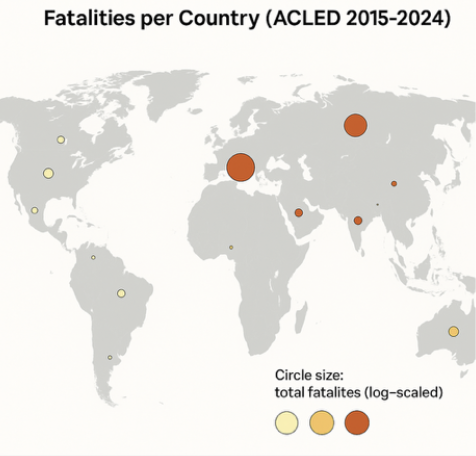

# Colorpleth Map

Visually show which economies are resource-dependent, supporting your finding that primary-sector-dominant countries experience more violent conflict.
• Countries shaded from light yellow (low primary %) → dark brown (high primary %)
• Somalia, Afghanistan, Niger, Chad, etc. appear darkest
• Europe, North America, Japan appear light
• Legend: Primary Sector as % of GDP
• Layer matches well with conflict intensity hotspots

https://data.worldbank.org/indicator/NV.AGR.TOTL.ZS?utm_source=chatgpt.com

It geographically reveals where resource dependency is clustered, making the connection to violent conflict patterns more intuitive.

# Proportional Symbol Map

“Fatalities per Country (ACLED 2015–2024)”
Purpose:
Show severity of conflict in absolute terms using bubble size.

### What it looks like:

A world map with circles placed at each country centroid
Circle size = total fatalities (log-scaled)
Ukraine and Afghanistan have the largest circles
Somalia, Mexico also large
Italy and the U.S. have very small or tiny circles
Optional: color the circles by conflict type (e.g., red for battles, orange for remote violence)

### Why it supports the storyline:

It visually communicates the dramatic difference in deadliness between primary-sector economies and service economies.

https://acleddata.com/conflict-data/download-data-files/aggregated-data?utm_source=chatgpt.com

