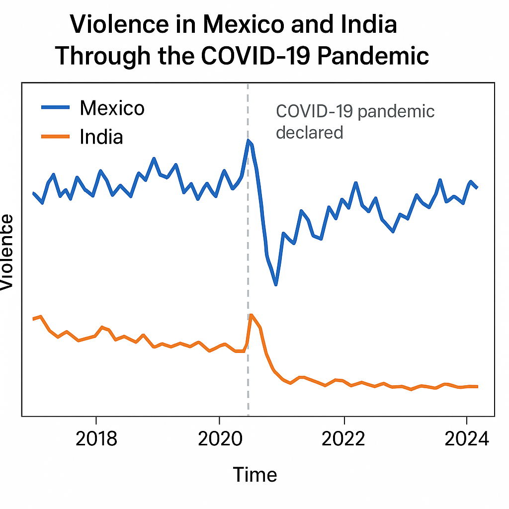

**Violence in Mexico and India Before and after the pandemic of Covid-19** 

When comparing India and Mexico using ACLED raw event-level data, a clear difference appears in both of violence before and after the Covid-19 pandemic. 

Mexico shows consistently high levels of political violence throughout the entire period (2018-present), driven largely by organized criminal groups, cartel competition and frequent violence against civilians. These dynamics continued through Covid: after a short initial decrease due to mobility restictions, violence quickly rebounded as cartels adapted and explited the economic strain in Mexicos's large informal tertiary sector. 

India, by contrast, recorded much lower levels of political violence before Covid, with unrest driven mainly by protests and social tensions. Because india's economy is strongly shaped by a vast tertiary sector, services, transport, retail and informal work, the strict nationwide lockdown sharply reduced mobility. This led to a temporary collapse of protest activity rather than an escalation of violence. Instead, violence shifted toward local enforcement clashes and community tensions, with major protest movements reappearing only as the service sector reopened later in 2020 and 2021. 

Overall, Mexico's violence remained high and criminal-driven, while India's violence was episodic and shaped by mobility restrictions in the tertiary sector, leading to a temporary decline and later transformation of political unrest. 

